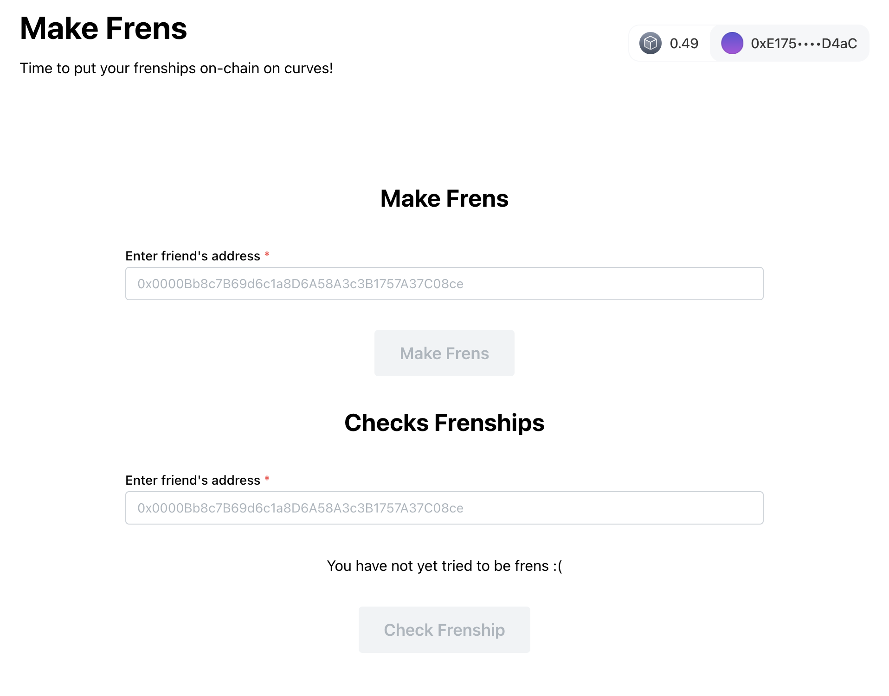

# Frencurve

Built on [Lens Network](https://dev-preview.lens.xyz/docs/network/overview) for [Lens Holiday Hackathon](https://www.lens.xyz/news/lens-holiday-hackathon) using [ConnectKit](https://github.com/family/connectkit) and [Hardhat](https://dev-preview.lens.xyz/docs/network/getting-started/hardhat).



## Curve Friendship

Every account in EVM has an address, derived from a public key, derived from a private key. Public key is simply a coordinate on an "[elliptic-curve](https://www.rareskills.io/post/elliptic-curves-finite-fields)", so basically it is a point $(x, y) \in \mathbb{F}_p^2$ for some large prime $p$ such that it satisfies the following curve equation of [`secp256k1`](https://en.bitcoin.it/wiki/Secp256k1):

$$
y^2 = x^3 + 7
$$

A curve-friendship for a pair of points $p, q$ some value threshold `t` is defined as a function $\text{Fren} : \mathbb{F}_p^2 \times \mathbb{F}_p^2 \to \{0, 1\}$ which is given below:

$$
\text{Fren}(p, q) =
\begin{cases}
  1 & \text{Dist}(p, q) < t \\
  0 & \text{Dist}(p, q) \geq t
\end{cases}
$$

and the distance function $\text{Dist}: \mathbb{F}_p \times \mathbb{F}_p \mapsto \{0, 1\}^{256}$ is defined as a generic distance function between two points on the curve over the respective field, such that the distance is mapped to a word in EVM. So now, you and your friends can register on-chain, and unlock new potential use-cases with your mathematically provable friendship!

## Contract

Frencurve contract is deployed on [Lens Testnet](https://block-explorer.testnet.lens.dev/address/0x4D9058C198c1c9433612F6dA4f271Ee7D7eB0459#transactions). You can interact with it as follows:

- `register({x, y})` with the coordinates of your public key, using the corresponding wallet.
- `makeFrens(address, address)` with another address, permanently marking whether you are frens or not on chain!
- call `frenships(address, address)` to read frenships of addresses.

## Usage

Install everything with:

```sh
pnpm install
```

Then run with:

```sh
pnpm run dev
# live at http://localhost:5173/
```

### Contracts

We are using the template, initialized with:

```sh
git clone --depth=1 --branch=master git@github.com:lens-protocol/lens-network-hardhat-boilerplate.git contracts && rm -rf ./contracts/.git
```

For this part, read the [README](./contracts/README.md) within the contracts folder.

<!-- This is a [Vite](https://vitejs.dev) project bootstrapped with [`create-wagmi`](https://github.com/wevm/wagmi/tree/main/packages/create-wagmi). -->
